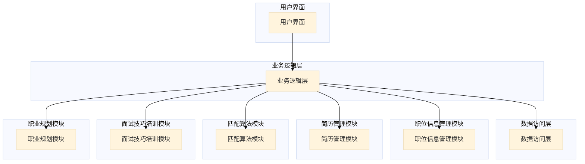

```mermaid
%%{init: {'theme': 'base', 'themeVariables': { 'fontFamily': 'Arial' }}}%%
graph TD;
    subgraph "用户界面"
        UI[用户界面]
    end
    subgraph "业务逻辑层"
        BL[业务逻辑层]
    end
    subgraph "数据访问层"
        DAL[数据访问层]
    end
    subgraph "职位信息管理模块"
        JobManagement[职位信息管理模块]
    end
    subgraph "简历管理模块"
        ResumeManagement[简历管理模块]
    end
    subgraph "匹配算法模块"
        MatchingAlgorithm[匹配算法模块]
    end
    subgraph "面试技巧培训模块"
        InterviewTraining[面试技巧培训模块]
    end
    subgraph "职业规划模块"
        CareerPlanning[职业规划模块]
    end

    UI --> BL
    BL --> DAL
    BL --> JobManagement
    BL --> ResumeManagement
    BL --> MatchingAlgorithm
    BL --> InterviewTraining
    BL --> CareerPlanning

```